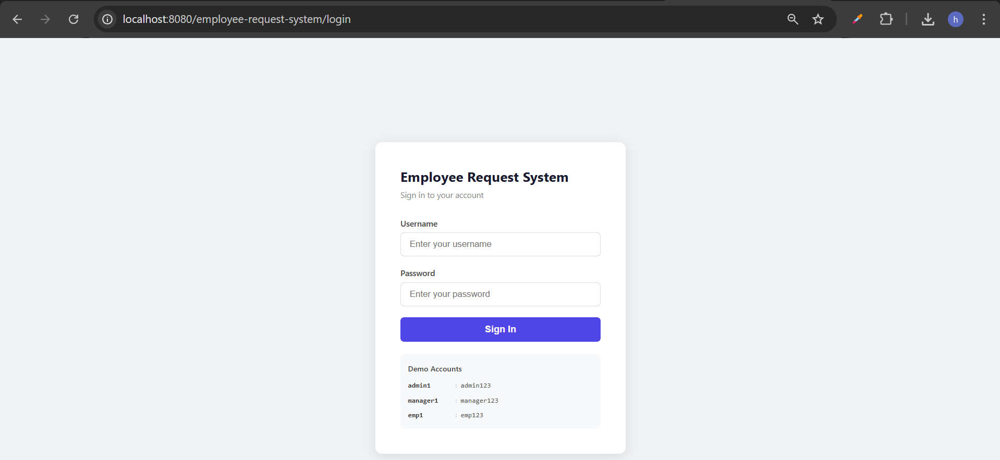
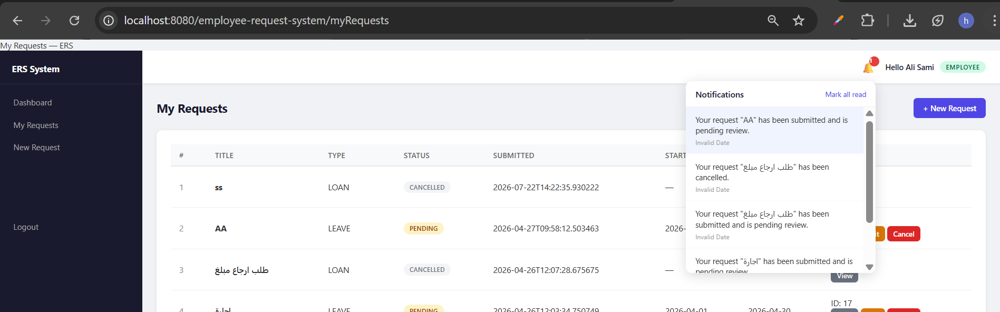

# Employee Request Management System

A web-based application for managing employee requests — leave, loans, and training — with a structured approval workflow, role-based access control, and a full audit trail. Built with **Java Struts 2**, JSP, and PostgreSQL.

---

## Table of Contents

- [Features](#features)
- [Tech Stack](#tech-stack)
- [Project Structure](#project-structure)
- [Database Schema](#database-schema)
- [Getting Started](#getting-started)
- [Configuration](#configuration)
- [Struts 2 Architecture](#struts-2-architecture)
- [Usage](#usage)
- [Screenshots](#screenshots)
- [Contributing](#contributing)
- [License](#license)

---

## Features

| Area                   | Details                                                                  |
| ---------------------- | ------------------------------------------------------------------------ |
| Authentication & Roles | Login with role-based access: **Admin**, **Manager**, **Employee**       |
| Request Management     | Submit, track, and manage Leave, Loan, and Training requests             |
| Approval Workflow      | Managers approve or reject requests; employees are notified at each step |
| Audit Trail            | Every action on a request is logged with timestamp and actor             |
| Admin Tools            | User and department management restricted to Admin role                  |
| Responsive UI          | Works on desktop and mobile via Bootstrap                                |

---

## Tech Stack

| Layer     | Technology                       | Details                                       |
| --------- | -------------------------------- | --------------------------------------------- |
| Framework | **Struts 2**                     | MVC framework — action-based request handling |
| Backend   | Java 11, JSP                     | Action classes, service layer, JDBC           |
| Frontend  | HTML, CSS, JavaScript, Bootstrap | Struts 2 tag library for form rendering       |
| Database  | PostgreSQL                       | Relational schema with audit tables           |
| Build     | Maven                            | Dependency management and WAR packaging       |
| Server    | Apache Tomcat                    | Servlet container                             |

### Key Struts 2 plugins used

| Plugin                           | Purpose                                                        |
| -------------------------------- | -------------------------------------------------------------- |
| `struts2-convention-plugin`      | Annotation-based action and result mapping (no XML per action) |
| `struts2-tiles-plugin`           | Page layout composition with Apache Tiles                      |
| `struts2-json-plugin`            | JSON results for AJAX responses                                |
| `struts2-bean-validation-plugin` | JSR-380 bean validation on action fields                       |

---

## Project Structure

```
employee-request-system/
├── src/
│   └── main/
│       ├── java/
│       │   └── com/ers/
│       │       ├── action/            ← Struts 2 Action classes (one per use case)
│       │       │   ├── AuthAction.java
│       │       │   ├── RequestAction.java
│       │       │   ├── ApprovalAction.java
│       │       │   └── AdminAction.java
│       │       ├── service/           ← Business logic layer
│       │       ├── dao/               ← JDBC data access objects
│       │       ├── model/             ← Domain models (User, Request, Department…)
│       │       └── util/              ← DB connection, email, constants
│       └── webapp/
│           ├── WEB-INF/
│           │   ├── web.xml            ← StrutsPrepareAndExecuteFilter config
│           │   ├── struts.xml         ← Global Struts 2 configuration
│           │   └── classes/
│           │       └── db.properties  ← DB & email settings
│           ├── jsp/                   ← JSP views (rendered via Struts results)
│           │   ├── home.jsp
│           │   ├── dashboard.jsp
│           │   ├── request-form.jsp
│           │   ├── approval.jsp
│           │   └── error.jsp
│           └── assets/                ← CSS, JS, images
├── database-schema.sql
└── pom.xml
```

---

## Database Schema

The schema is defined in [`database-schema.sql`](database-schema.sql) and includes table definitions, indexes, and sample seed data.

| Table             | Purpose                                   |
| ----------------- | ----------------------------------------- |
| `users`           | Employee, manager, and admin accounts     |
| `departments`     | Organizational structure                  |
| `requests`        | Leave, loan, and training requests        |
| `request_actions` | Audit log of all approvals and rejections |
| `notifications`   | In-app notifications per user             |

---

## Getting Started

### 1. Database setup

```bash
# Create the database
createdb ers_db

# Run the schema and seed script
psql -d ers_db -f database-schema.sql
```

### 2. Configure the application

Edit `src/main/webapp/WEB-INF/classes/db.properties`:

```properties
db.url=jdbc:postgresql://localhost:5432/ers_db
db.username=your_db_user
db.password=your_db_password

# Optional — email notifications
mail.smtp.host=smtp.example.com
mail.smtp.port=587
mail.username=no-reply@example.com
mail.password=your_email_password
```

### 3. Build and deploy

```bash
mvn clean package
cp target/employee-request-system.war $CATALINA_HOME/webapps/
```

### 4. Access the application

```
http://localhost:8080/employee-request-system
```

**Default admin credentials** (change immediately after first login):

| Field    | Value      |
| -------- | ---------- |
| Username | `admin1`   |
| Password | `admin123` |

| Username | `emp1` |
| Password | `emp123` |

| Username | `manager1` |
| Password | `manager123` |

> **Security notice:** The default credentials are for local development only. Update them before deploying to any shared or production environment.

---

## Configuration

### `struts.xml` — global Struts settings

```xml
<struts>
    <constant name="struts.devMode" value="false" />
    <constant name="struts.action.extension" value="action,," />
    <constant name="struts.convention.action.packages" value="com.ers.action" />
    <constant name="struts.convention.result.path" value="/WEB-INF/jsp/" />
</struts>
```

| Constant                            | Value            | Purpose                                       |
| ----------------------------------- | ---------------- | --------------------------------------------- |
| `struts.devMode`                    | `false`          | Enable `true` locally for verbose error pages |
| `struts.action.extension`           | `action,,`       | Allows URLs with or without `.action` suffix  |
| `struts.convention.action.packages` | `com.ers.action` | Package scanned for `@Action` annotations     |
| `struts.convention.result.path`     | `/WEB-INF/jsp/`  | Default JSP view location                     |

### `web.xml` — Struts filter

```xml
<filter>
    <filter-name>struts2</filter-name>
    <filter-class>org.apache.struts2.dispatcher.filter.StrutsPrepareAndExecuteFilter</filter-class>
</filter>
<filter-mapping>
    <filter-name>struts2</filter-name>
    <url-pattern>/*</url-pattern>
</filter-mapping>
```

### `db.properties` — application settings

| Property                      | Description                           |
| ----------------------------- | ------------------------------------- |
| `db.url`                      | PostgreSQL JDBC connection string     |
| `db.username` / `db.password` | Database credentials                  |
| `mail.smtp.*`                 | SMTP settings for email notifications |

---

## Struts 2 Architecture

This application follows the standard Struts 2 MVC pattern:

```
Browser Request
      │
      ▼
StrutsPrepareAndExecuteFilter   (web.xml)
      │
      ▼
  Action Class                  (com.ers.action.*)
  ├── Validates input            (@Validation, bean-validation-plugin)
  ├── Calls Service layer        (com.ers.service.*)
  │     └── Calls DAO layer      (com.ers.dao.*)
  └── Returns result string      ("success", "error", "input")
      │
      ▼
  Result mapping                 (struts.xml or @Action annotation)
      │
      ▼
  JSP View                       (WEB-INF/jsp/*.jsp)
  └── Struts 2 tag library       <%@ taglib prefix="s" uri="/struts-tags" %>
```

### Action class example

```java
@Namespace("/")
@Action(value = "submitRequest",
        results = {
            @Result(name = "success", location = "dashboard.jsp"),
            @Result(name = "input",   location = "request-form.jsp"),
            @Result(name = "error",   location = "error.jsp")
        })
public class RequestAction extends ActionSupport implements SessionAware {

    @Inject
    private RequestService requestService;

    private RequestModel request;   // populated from form fields via OGNL

    @Override
    public String execute() throws Exception {
        requestService.submit(request, getSession());
        return SUCCESS;
    }

    // getters & setters ...
}
```

### Session management

The Struts session (`Map<String, Object>`) is used to store the authenticated user after login. All protected actions implement `SessionAware` and verify the session at the start of `execute()`. Unauthenticated requests return `"error"` which maps to `error.jsp`.

```java
if (session.get("loggedInUser") == null) {
    addActionError("You must be logged in to perform this action.");
    return ERROR;
}
```

### URL mapping

| URL               | Action Class     | Result Views                         |
| ----------------- | ---------------- | ------------------------------------ |
| `/home`           | —                | `home.jsp`                           |
| `/login`          | `AuthAction`     | `dashboard.jsp` / `error.jsp`        |
| `/submitRequest`  | `RequestAction`  | `dashboard.jsp` / `request-form.jsp` |
| `/approveRequest` | `ApprovalAction` | `dashboard.jsp` / `error.jsp`        |
| `/admin`          | `AdminAction`    | `admin.jsp` / `error.jsp`            |

---

## Usage

### Employee

1. Log in with your credentials.
2. Go to **New Request** to submit a Leave, Loan, or Training request.
3. Track the status of your requests under **My Requests**.
4. Check **Notifications** for updates on approvals or rejections.

### Manager

1. Open **Pending Approvals** to review requests from your team.
2. Approve or reject each request — the employee is notified automatically.
3. Review the full request history under **Request History**.

### Admin

All employee and manager actions, plus:

1. **User Management** — create, edit, and deactivate user accounts.
2. **Department Management** — add and manage organizational departments.
3. **Audit Log** — view a full timestamped log of all request actions.

---

## Screenshots

| Screen | Preview |
|---|---|
| Login |  |
| Employee Dashboard |  |
| Employee — New Request |  |
| Employee — My Requests |  |
| Manager Dashboard |  |
| Department Requests |  |
| Admin Dashboard |  |
| Employees Management |  |
| Notifications |  |
| Reports |  |
| Email Notification |  |

